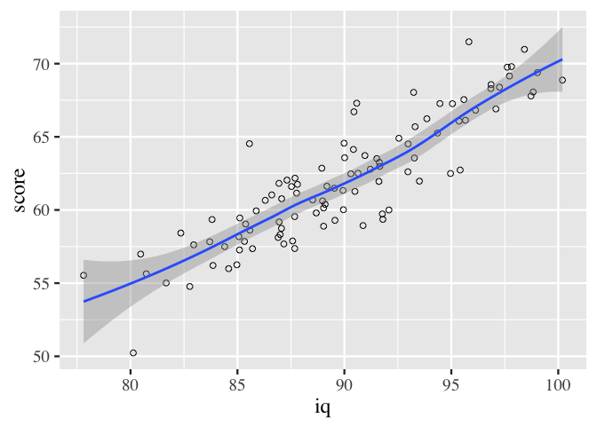

Título bonito
================
Superwoman
Last update: 2019-03-28 10:09:04

<!-- INTRODUCTION -->
Introduction
============

-   Motivation of the study
-   Goal of the study
-   Theoretical framework
-   Literature review
-   Research questions and hypothesis

<!-- METHOD -->
Method
======

1.  Participants

<!-- -->

1.  How many participants will participate in the study
2.  Who will participate in the study
3.  Where are they from
4.  Age of participants

<!-- -->

1.  Materials

<!-- -->

1.  What are the materials used
2.  how were they developed
3.  Are they your own materials

<!-- -->

1.  Design

<!-- -->

1.  describe design of the study
2.  what variables will be measured

<!-- -->

1.  Procedure

<!-- -->

1.  How was the experiment conducted in order; step by step

<!-- RESULTS -->
Results
=======

<!-- DISCUSSION -->
Discussion
==========

-   Re-state the research problem.
-   Answer the research questions.
-   Describe the patterns and relationships shown in the findings. (from general to specific)
-   Link findings to literature and theory.
-   Discuss the significance of findings.

Conclusion
==========

-   Highlight key findings.
-   Summarize your thoughts on the significance and the impact of the study.
-   Identify how a gap in the literature has been addressed.
